# OpenMAIC - 变更记录 (Changelog)

- **2026-04-15** 首次生成 CLAUDE.md 索引文档
  - 项目确认为 pnpm monorepo + Next.js 16 主应用结构
  - 识别到 3 个模块：主应用、mathml2omml、pptxgenjs
  - 覆盖率约 69%（312/450 文件），未截断

---

# OpenMAIC

> 开源 AI 互动课堂平台。上传 PDF 即时生成沉浸式多 Agent 学习体验。

**版本**: v0.1.1 | **许可证**: AGPL-3.0 | **Node**: >=20.9.0 | **包管理器**: pnpm@10.28.0

## 项目愿景

OpenMAIC 是一个开源的 AI 互动课堂平台，通过多 Agent 协作和 LLM 生成技术，将 PDF 教材自动转化为包含交互式幻灯片、PBL 场景、Quiz 测验、圆桌讨论等多种学习模式的沉浸式课堂体验。

## 架构总览

### Mermaid 模块结构图

```mermaid
graph TD
    ROOT["(根) OpenMAIC"] --> APP["主应用 (Next.js 16)"]
    ROOT --> PKG_MATHML["packages/mathml2omml"]
    ROOT --> PKG_PPTX["packages/pptxgenjs"]

    APP --> APP_LAYOUT["app/layout.tsx"]
    APP --> APP_PAGES["app/page.tsx"]
    APP --> APP_CLASSROOM["app/classroom/[id]"]
    APP --> APP_GEN_PREVIEW["app/generation-preview"]
    APP --> APP_API["app/api/**/* (29 routes)"]

    APP --> COMPONENTS
    COMPONENTS --> COMP_AI["ai-elements/ (22 components)"]
    COMPONENTS --> COMP_AGENT["agent/ (4 components)"]
    COMPONENTS --> COMP_AUDIO["audio/ (2 components)"]
    COMPONENTS --> COMP_CHAT["chat/ (6 components)"]
    COMPONENTS --> COMP_CANVAS["canvas/ (2 components)"]
    COMPONENTS --> COMP_GEN["generation/ (4 components)"]
    COMPONENTS --> COMP_HEADER["header.tsx"]
    COMPONENTS --> COMP_LANG["language-switcher.tsx"]
    COMPONENTS --> COMP_ROUND["roundtable/ (3 components)"]
    COMPONENTS --> COMP_SCENE["scene-renderers/ (7 components)"]
    COMPONENTS --> COMP_SETTINGS["settings/ (12 components)"]
    COMPONENTS --> COMP_SLIDE["slide-renderer/ (40+ components)"]
    COMPONENTS --> COMP_UI["ui/ (25+ components)"]
    COMPONENTS --> COMP_WB["whiteboard/ (2 components)"]
    COMPONENTS --> COMP_STAGE["stage.tsx"]

    APP --> LIB
    LIB --> LIB_ACT["action/ (engine.ts)"]
    LIB --> LIB_AI["ai/ (llm, providers, thinking-context)"]
    LIB --> LIB_API["api/ (12 stage-api files)"]
    LIB --> LIB_AUDIO["audio/ (7 files + providers)"]
    LIB --> LIB_BUFFER["buffer/ (stream-buffer.ts)"]
    LIB --> LIB_CHAT["chat/ (action-translations.ts)"]
    LIB --> LIB_CONST["constants/ (2 files)"]
    LIB --> LIB_CTX["contexts/ (2 context files)"]
    LIB --> LIB_EXPORT["export/ (12 files + html-parser)"]
    LIB --> LIB_GEN["generation/ (15 files + prompts)"]
    LIB --> LIB_HOOKS["hooks/ (11 custom hooks)"]
    LIB --> LIB_I18N["i18n/ (4 locales: en, zh, ja, ru)"]
    LIB --> LIB_IMPORT["import/ (use-import-classroom.ts)"]
    LIB --> LIB_MEDIA["media/ (12 adapters + orchestrator)"]
    LIB --> LIB_ORCH["orchestration/ (10 files)"]
    LIB --> LIB_PBL["pbl/ (10 files + mcp agents)"]
    LIB --> LIB_PDF["pdf/ (providers + constants)"]
    LIB --> LIB_PLAYBACK["playback/ (4 files)"]
    LIB --> LIB_SERVER["server/ (9 files)"]
    LIB --> LIB_STORE["store/ (8 Zustand stores)"]
    LIB --> LIB_TYPES["types/ (12 type files)"]
    LIB --> LIB_UTILS["utils/ (database, chat-storage, element, etc.)"]
    LIB --> LIB_WS["web-search/ (3 files)"]

    PKG_MATHML --> MATH_SRC["src/mathml/* (15 converters)"]
    PKG_MATHML --> MATH_OOML["src/ooml/* (3 files)"]
    PKG_MATHML --> MATH_PARSE["src/parse-stringify/* (4 files)"]

    PKG_PPTX --> PPTX_CORE["src/pptxgen.ts + core-*.ts"]
    PKG_PPTX --> PPTX_GEN["src/gen-*.ts (charts, media, objects, tables, utils, xml)"]
    PKG_PPTX --> PPTX_SLIDE["src/slide.ts"]

    click APP "./CLAUDE.md#模块索引"
    click PKG_MATHML "./packages/mathml2omml/CLAUDE.md" "查看 mathml2omml 模块文档"
    click PKG_PPTX "./packages/pptxgenjs/CLAUDE.md" "查看 pptxgenjs 模块文档"
    click APP_API "./CLAUDE.md#api-路由"
    click COMP_SLIDE "./CLAUDE.md#幻灯片编辑器"
    click LIB_GEN "./CLAUDE.md#ai-生成流水线"
    click LIB_STORE "./CLAUDE.md#状态管理"
```



## 模块索引

| 模块路径 | 类型 | 语言 | 入口文件 | 职责描述 |
|---------|------|------|---------|---------|
| `.` (主应用) | application | TypeScript | `app/layout.tsx` | Next.js 16 主应用：页面路由、API、组件库、业务逻辑 |
| `packages/mathml2omml` | package | JavaScript | `dist/index.js` | MathML 到 OMML 转换，支持 LaTeX 数学公式导出 |
| `packages/pptxgenjs` | package | TypeScript | `src/pptxgen.ts` | JavaScript PowerPoint 生成库（forked PptxGenJS） |

### 主应用模块详细索引

| 子模块 | 文件数 | 关键文件 | 职责 |
|-------|--------|---------|------|
| `app/api/` | 29 routes | `chat/`, `generate/`, `classroom/`, `pbl/` | REST API 端点 |
| `components/ai-elements/` | 22 | `message.tsx`, `canvas.tsx`, `toolbar.tsx` | AI 对话界面元素 |
| `components/agent/` | 4 | `agent-bar.tsx`, `agent-config-panel.tsx` | Agent 配置与头像 |
| `components/audio/` | 2 | `speech-button.tsx`, `tts-config-popover.tsx` | 语音输入/TTS |
| `components/chat/` | 6 | `chat-area.tsx`, `chat-session.tsx` | 聊天与会话管理 |
| `components/scene-renderers/` | 7+ | `interactive-renderer.tsx`, `pbl-renderer.tsx` | 场景渲染器 |
| `components/settings/` | 12 | `index.tsx`, `provider-config-panel.tsx` | 设置面板 |
| `components/slide-renderer/` | 40+ | `Editor/`, `components/element/` | 幻灯片编辑器 |
| `lib/action/` | 1 | `engine.ts` | AI 操作执行引擎 |
| `lib/ai/` | 3 | `llm.ts`, `providers.ts` | LLM 适配层 |
| `lib/api/` | 12 | `stage-api-*.ts` | Stage API 封装 |
| `lib/generation/` | 15+ | `pipeline-runner.ts`, `scene-generator.ts` | AI 生成流水线 |
| `lib/orchestration/` | 10 | `director-graph.ts`, `tool-schemas.ts` | AI SDK 编排 |
| `lib/pbl/` | 10+ | `mcp/*`, `generate-pbl.ts` | PBL 系统 |
| `lib/store/` | 8 | `settings.ts`, `stage.ts`, `canvas.ts` | Zustand 状态管理 |
| `lib/types/` | 12 | `slides.ts`, `chat.ts`, `settings.ts` | TypeScript 类型 |

## 全局规范

### 语言与框架

- **语言**: TypeScript 5 (主应用), JavaScript (mathml2omml)
- **运行时**: Node.js >=20.9.0
- **前端框架**: Next.js 16 + React 19
- **状态管理**: Zustand 5
- **样式**: Tailwind CSS 4 + CSS Variables + Geist 字体
- **UI 组件**: Shadcn/UI + Radix primitives + Base UI
- **路由**: Next.js App Router
- **数据验证**: Zod 4

### AI / LLM 集成

- **SDK**: Vercel AI SDK (`ai` v6) + `@ai-sdk/react`
- **支持模型**: OpenAI, Anthropic Claude, Google Gemini, Azure OpenAI, DeepSeek, Grok, Ollama, Qwen, 等
- **Provider 配置**: 支持自定义 baseUrl (私有化部署)
- **MCP 集成**: `@modelcontextprotocol/sdk` + 自定义 MCP agents

### 媒体处理

- **图片生成**: MiniMax, Minimax, Qwen, Kling, Seedance, Seedream, Veo, Grok, OpenAI DALL-E
- **视频生成**: MiniMax, Kling
- **TTS**: Azure, OpenAI, minimax, minimax-tts
- **ASR**: Browser Web Speech API
- **PDF 解析**: unpdf (服务端)

### 构建与工具链

- **包管理器**: pnpm 10.28.0 (monorepo workspace)
- **构建**: Next.js build (standalone output)
- **打包**: Rollup (packages), Next.js (app)
- **测试**: Vitest (单元) + Playwright (E2E)
- **代码检查**: ESLint 9 + Prettier 3
- **容器化**: Docker + Docker Compose (Node 22 Alpine)

## 命令参考

```bash
# 开发与构建
pnpm dev              # 启动开发服务器 (localhost:3000)
pnpm build            # 生产构建
pnpm start            # 启动生产服务器
pnpm postinstall      # 构建子包 (mathml2omml, pptxgenjs)

# 代码质量
pnpm lint             # ESLint 检查
pnpm check            # Prettier 格式检查
pnpm format           # Prettier 格式化

# 测试
pnpm test             # Vitest 单元测试 (tests/**/*.test.ts)
pnpm test:e2e         # Playwright E2E 测试
pnpm test:e2e:ui      # Playwright E2E (UI 模式)

# Docker
docker compose up -d  # 启动生产容器 (端口 80)
```

### 环境变量

| 变量 | 说明 |
|------|------|
| `OPENAI_API_KEY` | OpenAI API 密钥 |
| `ANTHROPIC_API_KEY` | Anthropic API 密钥 |
| `GOOGLE_GENERATIVE_AI_API_KEY` | Google API 密钥 |
| `ACCESS_CODE` | 访问码 (启用 HMAC 验证) |
| `VERCEL` | 是否运行在 Vercel 平台 |
| `.env.local` | 本地环境变量 (不提交) |
| `server-providers.yml` | 服务提供商配置 (不提交，含 API keys) |

## 测试策略

### 单元测试 (Vitest)

- 框架: `vitest.config.ts`
- 目录: `tests/**/*.test.ts`
- 排除: `tests/**/*.eval.test.ts` (评估测试)
- 环境设置: `tests/setup-env.ts` (加载 `.env.local`)
- 测试文件:
  - `tests/store/settings-validation.test.ts`
  - `tests/store/settings-server-sync.test.ts`
  - `tests/server/provider-config.test.ts`
  - `tests/server/classroom-agent-mode.test.ts`
  - `tests/export/classroom-zip.test.ts`

### E2E 测试 (Playwright)

- 配置: `playwright.config.ts`
- 目录: `e2e/tests/`
- 端口: 3002
- 测试文件:
  - `e2e/tests/full-happy-path.spec.ts`
  - `e2e/tests/generation-flow.spec.ts`
  - `e2e/tests/classroom-interaction.spec.ts`
  - `e2e/tests/home-to-generation.spec.ts`
- Fixture: `e2e/fixtures/` + `e2e/pages/`

## API 路由

### 核心生成 API

| 路由 | 方法 | 说明 |
|------|------|------|
| `/api/generate/scene-outlines-stream` | POST | 流式生成课程大纲 |
| `/api/generate/scene-content` | POST | 生成场景内容 |
| `/api/generate/scene-actions` | POST | 生成交互动作 |
| `/api/generate/agent-profiles` | POST | 生成 Agent 画像 |
| `/api/generate/video` | POST | 视频生成请求 |
| `/api/generate/image` | POST | 图片生成请求 |
| `/api/generate/tts` | POST | TTS 生成请求 |

### 课堂管理 API

| 路由 | 方法 | 说明 |
|------|------|------|
| `/api/classroom` | GET/POST | 课堂 CRUD |
| `/api/classroom-media/[classroomId]/[...path]` | GET | 课堂媒体代理 |
| `/api/generate-classroom` | POST | 创建生成任务 |
| `/api/generate-classroom/[jobId]` | GET | 查询任务状态 |

### 聊天 API

| 路由 | 方法 | 说明 |
|------|------|------|
| `/api/chat` | POST | 通用聊天 |
| `/api/pbl/chat` | POST | PBL 模式聊天 |
| `/api/quiz-grade` | POST | Quiz 自动评分 |

### 辅助 API

| 路由 | 方法 | 说明 |
|------|------|------|
| `/api/parse-pdf` | POST | PDF 内容解析 |
| `/api/transcription` | POST | 语音转文字 |
| `/api/web-search` | POST | 网络搜索 (Tavily) |
| `/api/verify-model` | POST | 验证模型可用性 |
| `/api/verify-image-provider` | POST | 验证图片 provider |
| `/api/access-code/verify` | POST | 访问码验证 |
| `/api/health` | GET | 健康检查 |

## 状态管理

项目使用 Zustand 作为状态管理，共 8 个 store:

- `lib/store/settings.ts` - 应用设置 (Provider 配置、模型选择等)
- `lib/store/stage.ts` - 课堂舞台状态
- `lib/store/canvas.ts` - 画布编辑器状态
- `lib/store/snapshot.ts` - 历史快照
- `lib/store/media-generation.ts` - 媒体生成任务
- `lib/store/whiteboard-history.ts` - 白板历史
- `lib/store/user-profile.ts` - 用户画像 (头像、昵称、简介)
- `lib/store/keyboard.ts` - 键盘快捷键状态

### Settings Store 特殊说明

Settings Store 支持服务端同步，配置通过 IndexedDB 客户端存储，支持以下配置域:

- **Provider 配置**: 多种 AI/媒体/TTS/ASR/PDF/WebSearch provider
- **模型选择**: 支持自定义 baseUrl 的私有部署模型
- **访问码**: HMAC-SHA256 签名验证

## 数据存储

- **客户端**: IndexedDB (Dexie.js) - 课堂数据、草稿、设置
- **服务端**: 本地文件系统 (`/app/data`) via Docker volume
- **Session**: sessionStorage (生成会话) + localStorage (用户偏好)

## 幻灯片编辑器

`components/slide-renderer/` 是项目最复杂的子系统，包含:

- **Canvas 编辑器**: `Editor/Canvas/index.tsx` + 12 个操作 hooks
- **元素组件**: Text, Shape, Image, Video, Table, Chart, Line, LaTeX
- **元素操作**: 拖拽、缩放、旋转、边框、阴影、裁剪
- **渲染组件**: `ThumbnailSlide`, `SpotlightOverlay`, `LaserOverlay`
- **配置**: `configs/` 目录 (theme, shapes, lines, chart, animation, font, latex, hotkey)

## AI 生成流水线

`lib/generation/` 包含完整的 AI 内容生成流程:

1. **Pipeline Runner** (`pipeline-runner.ts`) - 流水线协调
2. **Outline Generator** (`outline-generator.ts`) - 课程大纲生成
3. **Scene Generator** (`scene-generator.ts`) - 场景内容生成
4. **Action Parser** (`action-parser.ts`) - 交互动作解析
5. **JSON Repair** (`json-repair.ts`) - LLM JSON 输出修复
6. **Interactive Post-Processor** (`interactive-post-processor.ts`) - 后处理
7. **Prompt Templates** (`prompts/templates/`) - 6 种场景模板

## 国际化

支持 4 种语言: `en-US`, `zh-CN`, `ja-JP`, `ru-RU`

- 配置文件: `lib/i18n/locales/`
- 使用: `react-i18next` + `i18next-resources-to-backend`

## Docker 部署

```yaml
# docker-compose.yml
services:
  openmaic:
    build: .
    ports: ["80:3000"]
    volumes: [openmaic-data:/app/data]
    env_file: .env.local
```

构建使用 4 阶段 Dockerfile:

1. **base**: Node 22 Alpine + pnpm
2. **deps**: 安装依赖 (含 sharp, @napi-rs/canvas 构建工具)
3. **builder**: 执行 `pnpm build`
4. **runner**: 精简运行镜像 (standalone output)

## AI 使用指引

### 开发新功能

1. 先查看 `lib/types/` 中对应的类型定义
2. 业务逻辑放在 `lib/` 对应子目录
3. UI 组件放在 `components/` 对应子目录
4. 添加 Vitest 测试到 `tests/`
5. 添加 E2E 测试到 `e2e/tests/`

### 添加新的 AI Provider

1. 在 `lib/ai/providers.ts` 添加 provider 配置
2. 在 `lib/media/` 或 `lib/audio/` 添加 adapter
3. 在 `components/settings/` 添加配置 UI
4. 更新 `lib/store/settings.ts` 中的类型定义

### 添加新的场景类型

1. 在 `lib/generation/prompts/templates/` 添加 prompt 模板
2. 在 `lib/generation/` 添加 generator
3. 在 `components/scene-renderers/` 添加 renderer
4. 在 `lib/types/` 添加类型定义
5. 添加对应的 API route

## 变更记录 (Changelog)

- **2026-04-15** 首次生成 CLAUDE.md 索引文档
